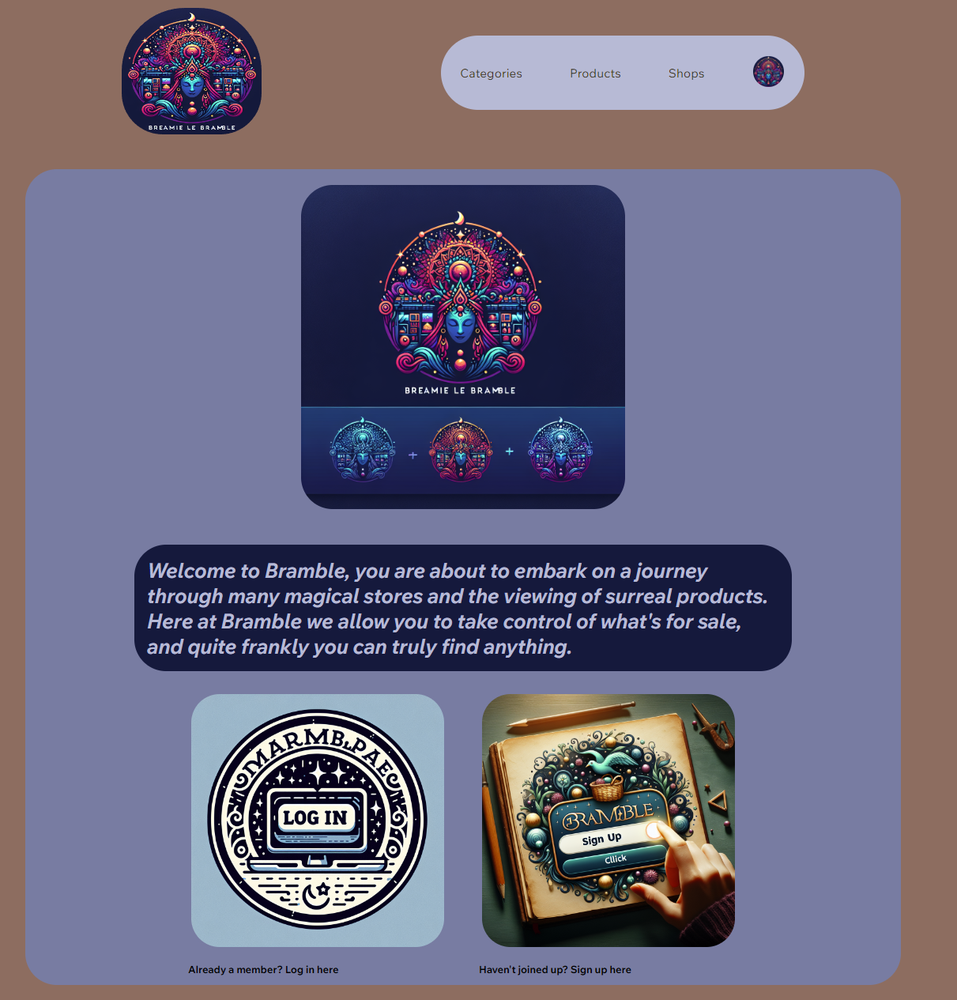
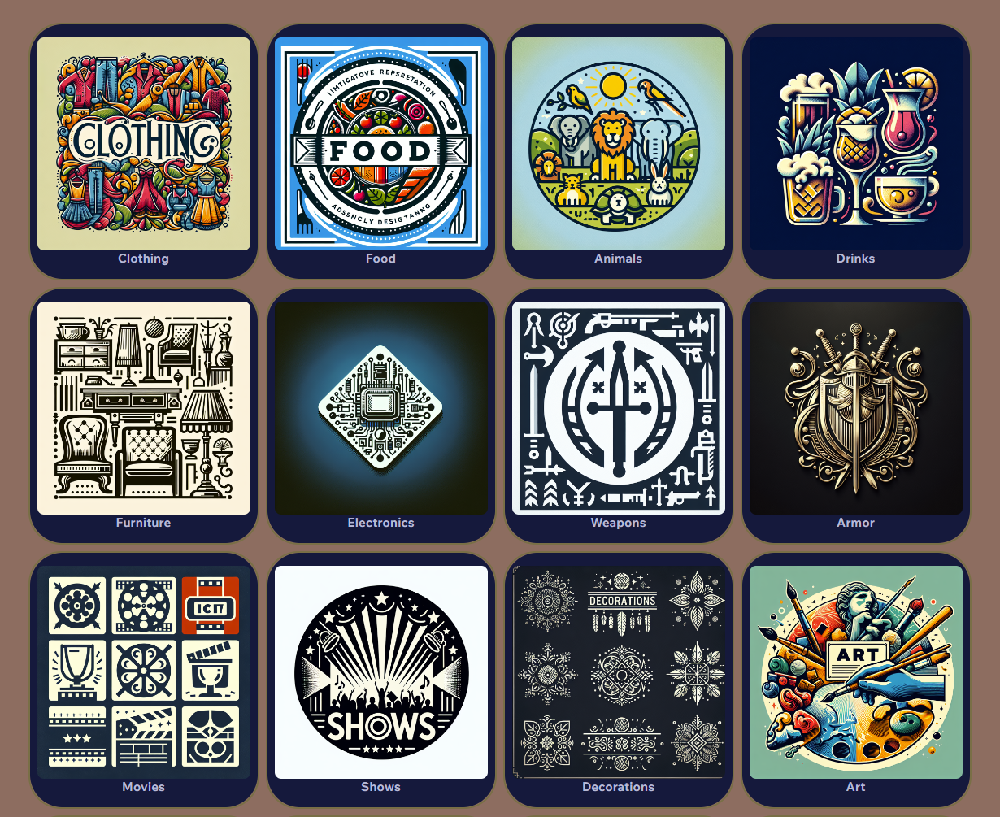
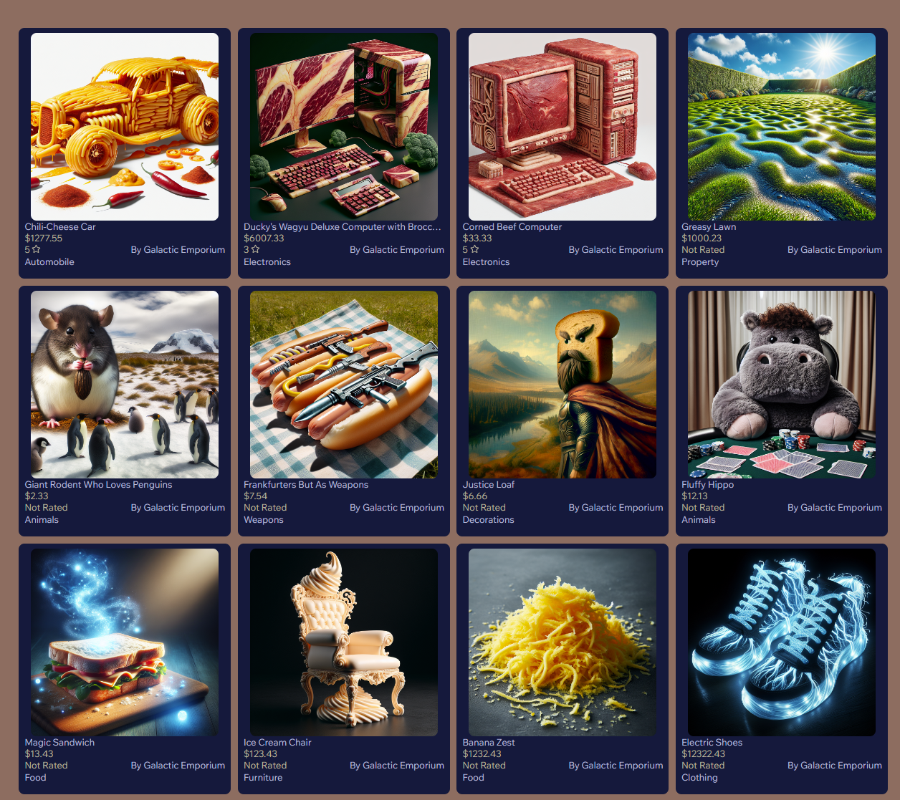
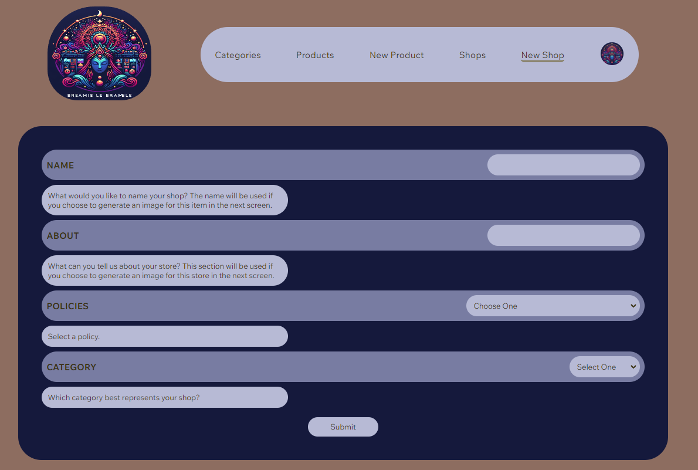
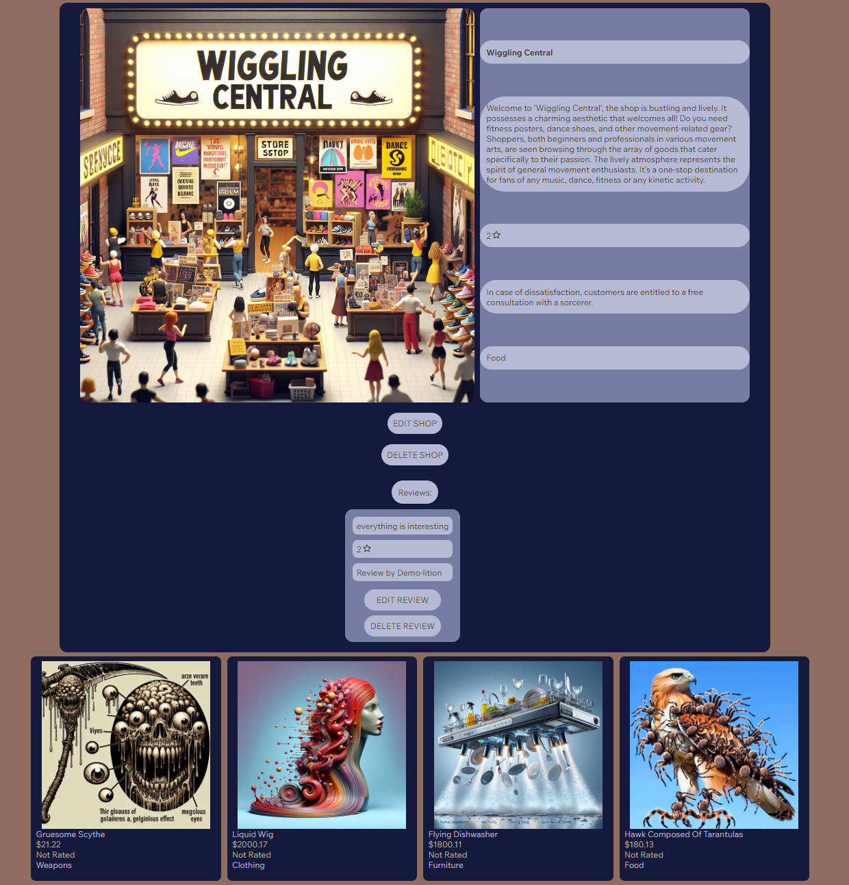

# Bramble

[Bramble Link](https://bramble-idq1.onrender.com/)

## Project Summary

Bramble is an Etsy clone with a mythical twist, users are encouraged to create their own categories, shops, and products with fantastic qualities. This site also features custom AI powered art generation influenced by user input.

## Screenshots

### Landing



### Categories



### Products



### Shops

[Shops Page](image-3.png)

### Create Product


### Create Shop



### Product Details


### Shop Details



## Build Instructions

- Clone Github Repository
- npm install in both the frontend and backend directories
- You will have create a .env file in the backend directory where you will need the following variables:

```
NODE_ENV=development
JWT_SECRET=<secret-here>
JWT_EXPIRES_IN=604800
SCHEMA=db/dev.db
DB_FILE=db/dev.db
AWS_ACCESS_KEY_ID=<key-here>
AWS_SECRET_ACCESS_KEY=<key here>
OPEN_API_KEY=<key here>
GOOGLE_OAUTH_CLIENT_ID=<key here>
GOOGLE_OAUTH_CLIENT_SECRET=<key here>
```

- After you will seed the database by running

```
npx dotenv sequelize db:migrate && npx dotenv sequelize db:seed:all
```

- You should then be ready to start your backend

```
npm start
```

- and frontend

```
npm run dev
```

- Open up your browser, typically with the vite package this application is using you should see your info at http://localhost:5173/

## Technologies used


## API

### Categories

#### Get All Categories

Route:
```js
router.get("/", async (req, res) => {
  const categories = await Category.findAll({
    include: { model: CategoryImage },
  });
  return res.json(categories);
});
```
Response:
```json
    {
        "id": 1,
        "name": "Clothing",
        "user_id": 1,
        "createdAt": "2024-04-14T02:06:43.339Z",
        "updatedAt": "2024-04-14T02:06:43.339Z",
        "CategoryImages": [
            {
                "id": 1,
                "image": "https://bramble-bucket.s3.amazonaws.com/1712959854586.png",
                "category_id": 1,
                "createdAt": "2024-04-14T02:06:43.502Z",
                "updatedAt": "2024-04-14T02:06:43.502Z"
            }
        ]
    },
    {
        "id": 2,
        "name": "Food",
        "user_id": 1,
        "createdAt": "2024-04-14T02:06:43.339Z",
        "updatedAt": "2024-04-14T02:06:43.339Z",
        "CategoryImages": [
            {
                "id": 2,
                "image": "https://bramble-bucket.s3.amazonaws.com/1712961404157.png",
                "category_id": 2,
                "createdAt": "2024-04-14T02:06:43.502Z",
                "updatedAt": "2024-04-14T02:06:43.502Z"
            }
        ]
    },
```

#### Get Category by Id
Route:
```js
router.get("/:id", async (req, res) => {
  const category = await Category.findByPk(req.params.id, {
    include: [
      { model: CategoryImage },
      {
        model: Product,
        where: { category_id: req.params.id },
        include: [{ model: Review }, { model: ProductImage }, { model: Shop }],
      },
    ],
  });
  res.json(category);
});
```
Response:
````json
{
    "id": 1,
    "name": "Clothing",
    "user_id": 1,
    "createdAt": "2024-04-14T02:06:43.339Z",
    "updatedAt": "2024-04-14T02:06:43.339Z",
    "CategoryImages": [
        {
            "id": 1,
            "image": "https://bramble-bucket.s3.amazonaws.com/1712959854586.png",
            "category_id": 1,
            "createdAt": "2024-04-14T02:06:43.502Z",
            "updatedAt": "2024-04-14T02:06:43.502Z"
        }
    ],
    "Products": [
        {
            "id": 12,
            "name": "Electric Shoes",
            "price": 12322.43,
            "description": "Imagine a pair of shoes, glowing with the incandescent intensity of pure electricity. Twisting serpents of blue and white electrical currents form the shape of the shoes, from the high arches to the sturdily crafted soles. Their laces are made from pulsating strands of electricity, creating a dazzling light show against a pitch-black background. Yet, despite their electrifying construction, they seem tangible and wearable, inviting yet cautionary.",
            "details": "Move like lightning",
            "shipping": "Free Shipping",
            "featured": false,
            "shop_id": 1,
            "category_id": 1,
            "user_id": 1,
            "createdAt": "2024-04-14T02:06:43.390Z",
            "updatedAt": "2024-04-14T02:06:43.390Z",
            "Reviews": [],
            "ProductImages": [
                {
                    "id": 12,
                    "image": "https://bramble-bucket.s3.us-east-2.amazonaws.com/img-CZ75FdCfTq61zaPa8hlhNLQH.png",
                    "product_id": 12,
                    "createdAt": "2024-04-14T02:06:43.449Z",
                    "updatedAt": "2024-04-14T02:06:43.449Z"
                }
            ],
            "Shop": {
                "id": 1,
                "name": "Galactic Emporium",
                "about": "A store known as the 'Galactic Emporium'. The intergalactic nature of the store is reflected in its offerings, with a wide variety of items that represent everything in the universe. Aliens of different kinds roam, exploring the diverse cosmic merchandise. The store's futuristic storefront has a cosmic theme with glowing stars, nebulae, and distant galaxies portrayed on its external appearance.",
                "policies": "none",
                "category_id": 1,
                "user_id": 1,
                "createdAt": "2024-04-14T02:06:43.366Z",
                "updatedAt": "2024-04-14T02:06:43.366Z"
            }
        },
        ```

#### Post New Category
Route:
```js
router.post("/new", [requireAuth, validateCategory], async (req, res) => {
  const { user } = req;
  const { name } = req.body;

  const category = await Category.create({
    name,
    user_id: user.id,
  });
  return res.status(201).json(category);
});

````
Request:
```json
{
  "name": "Pancakes"
}
```
Response:
```json
{
  "id": 20,
  "name": "Pancakes",
  "user_id": 1,
  "updatedAt": "2024-04-25T23:38:28.542Z",
  "createdAt": "2024-04-25T23:38:28.542Z"
}
```
Errors:
```json
    "errors": {
        "name": "Category name must be in letters and a minimum of three characters to a maximum of thirty characters."
    },
```

#### Edit Category by Id
Route:
```js
router.put("/:id", [requireAuth, validateCategory], async (req, res) => {
  const { user } = req;
  const { name } = req.body;

  const category = await Category.findByPk(req.params.id);

  if (!category) return res.status(404).json({ message: "Category Not Found" });
  if (category.user_id != user.id)
    return res.status(403).json({ message: "Forbidden" });

  category.name = name || category.name;
  await category.save();

  return res.json(category);
});
```
Request:
```json
{
  "name": "Lasagna"
}
```
Response:
```json
{
  "id": 20,
  "name": "Lasagna",
  "user_id": 1,
  "createdAt": "2024-04-25T23:38:28.542Z",
  "updatedAt": "2024-04-25T23:40:56.009Z"
}
```

#### Delete Category by Id
Route:
```js
router.delete("/:id", requireAuth, async (req, res) => {
  const { user } = req;

  const category = await Category.findByPk(req.params.id);

  if (!category) return res.status(404).json({ message: "Category Not Found" });
  if (category.user_id != user.id)
    return res.status(403).json({ message: "Forbidden" });

  await category.destroy();

  res.json({ message: `Deleted Category with id: ${req.params.id}` });
});
```
Response:
```json
{
  "message": "Deleted Category with id: 20"
}
```

### Products

#### Get All Products
Route:
```js
router.get("/", async (req, res) => {
  const products = await Product.findAll({
    include: [
      { model: Category },
      { model: Shop },
      { model: ProductImage },
      { model: Review, include: { model: User } },
      { model: User },
    ],
  });
  return res.json(products);
});
```
Response:
```json
 {
        "id": 1,
        "name": "Chili-Cheese Car",
        "price": 1277.55,
        "description": "Visualize a unique and creative automobile concept where the entire structure of the vehicle is created out of chili cheese. Pay attention to the details such as the aerodynamic design of the car, the wheels, and the imagined interior, all fashioned from the spicy, gooey texture of chili cheese. Imagine the cheese-wheel tires, the chili engine, and the cheese coated body all amalgamating to form an interesting, yet bizarre, spectacle of a chili cheese automobile!",
        "details": "spherical, round, dope",
        "shipping": "Free Shipping",
        "featured": true,
        "shop_id": 1,
        "category_id": 13,
        "user_id": 1,
        "createdAt": "2024-04-14T02:06:43.390Z",
        "updatedAt": "2024-04-18T21:29:07.653Z",
        "Category": {
            "id": 13,
            "name": "Automobile",
            "user_id": 3,
            "createdAt": "2024-04-14T02:06:43.339Z",
            "updatedAt": "2024-04-14T02:06:43.339Z"
        },
        "Shop": {
            "id": 1,
            "name": "Galactic Emporium",
            "about": "A store known as the 'Galactic Emporium'. The intergalactic nature of the store is reflected in its offerings, with a wide variety of items that represent everything in the universe. Aliens of different kinds roam, exploring the diverse cosmic merchandise. The store's futuristic storefront has a cosmic theme with glowing stars, nebulae, and distant galaxies portrayed on its external appearance.",
            "policies": "none",
            "category_id": 1,
            "user_id": 1,
            "createdAt": "2024-04-14T02:06:43.366Z",
            "updatedAt": "2024-04-14T02:06:43.366Z"
        },
        "ProductImages": [
            {
                "id": 1,
                "image": "https://bramble-bucket.s3.us-east-2.amazonaws.com/1712094842320.png",
                "product_id": 1,
                "createdAt": "2024-04-14T02:06:43.449Z",
                "updatedAt": "2024-04-14T02:06:43.449Z"
            }
        ],
        "Reviews": [
            {
                "id": 1,
                "body": "everything is wonderful",
                "rating": 5,
                "user_id": 1,
                "product_id": 1,
                "shop_id": null,
                "createdAt": "2024-04-14T02:06:43.425Z",
                "updatedAt": "2024-04-14T02:06:43.425Z",
                "User": {
                    "id": 1,
                    "username": "Demo-lition"
                }
            }
        ],
        "User": {
            "id": 1,
            "username": "Demo-lition"
        }
    },
    {
        "id": 2,
        "name": "Ducky's Wagyu Deluxe Computer with Broccoli Calculator",
        "price": 6007.33,
        "description": "Imagine a luxurious computer setup themed after the intricate marbling found in Wagyu beef. The computer includes a keyboard, a monitor, and a tower, all designed with rich texturization and colors to resemble the well-marbled meat. Alongside this decadent setup, there's a unique calculator designed to represent a fresh broccoli floret, capturing all its intricacies and details. These equipment together create an unusual, yet fascinating juxtaposition of indulgence and productivity.",
        "details": "Practical, Colorful, Seamless",
        "shipping": "Express Shipping",
        "featured": true,
        "shop_id": 1,
        "category_id": 6,
        "user_id": 1,
        "createdAt": "2024-04-14T02:06:43.390Z",
        "updatedAt": "2024-04-18T22:22:07.580Z",
        "Category": {
            "id": 6,
            "name": "Electronics",
            "user_id": 2,
            "createdAt": "2024-04-14T02:06:43.339Z",
            "updatedAt": "2024-04-14T02:06:43.339Z"
        },
        "Shop": {
            "id": 1,
            "name": "Galactic Emporium",
            "about": "A store known as the 'Galactic Emporium'. The intergalactic nature of the store is reflected in its offerings, with a wide variety of items that represent everything in the universe. Aliens of different kinds roam, exploring the diverse cosmic merchandise. The store's futuristic storefront has a cosmic theme with glowing stars, nebulae, and distant galaxies portrayed on its external appearance.",
            "policies": "none",
            "category_id": 1,
            "user_id": 1,
            "createdAt": "2024-04-14T02:06:43.366Z",
            "updatedAt": "2024-04-14T02:06:43.366Z"
        },
        "ProductImages": [
            {
                "id": 2,
                "image": "https://bramble-bucket.s3.amazonaws.com/1712103141293.png",
                "product_id": 2,
                "createdAt": "2024-04-14T02:06:43.449Z",
                "updatedAt": "2024-04-14T02:06:43.449Z"
            }
        ],
        "Reviews": [
            {
                "id": 3,
                "body": "everything is very mediocre",
                "rating": 3,
                "user_id": 1,
                "product_id": 2,
                "shop_id": null,
                "createdAt": "2024-04-14T02:06:43.425Z",
                "updatedAt": "2024-04-14T02:06:43.425Z",
                "User": {
                    "id": 1,
                    "username": "Demo-lition"
                }
            }
        ],
        "User": {
            "id": 1,
            "username": "Demo-lition"
        }
```

#### Post New Product
Route:
```js
router.post("/new", [requireAuth, validateProduct], async (req, res) => {
  const { user } = req;
  const {
    name,
    price,
    description,
    details,
    shipping,
    featured,
    shop_id,
    category_id,
  } = req.body;
```
Request:
```json
{
  "name": "Lasagna Gloves",
  "price": 12.22,
  "description": "These are gloves to make lasagna",
  "details": "Hip, Trendy, Satisfying",
  "shipping": "Free Shipping",
  "featured": true,
  "shop_id": 1,
  "category_id": 3
}
```
Response:
```json
{
  "id": 59,
  "name": "Lasagna Gloves",
  "price": 12.22,
  "description": "These are gloves to make lasagna",
  "details": "Hip, Trendy, Satisfying",
  "shipping": "Free Shipping",
  "featured": true,
  "shop_id": 1,
  "category_id": 3,
  "user_id": 1,
  "updatedAt": "2024-04-26T00:00:19.386Z",
  "createdAt": "2024-04-26T00:00:19.386Z"
}
```
Errors:
````json
    "errors": {
      "price": "Price must be entered as a float, preferably in an XX.XX format",
      "description": "Description must be between 10 and 900 characters.",
      "details": "Details must be selected.",
      "shipping": "Shipping must be selected.",
      "category_id": "Please select a category."
  },
  ```
````

#### Edit Product by Id
Route:
```js
router.put("/:id", [requireAuth, validateProduct], async (req, res) => {
  const { user } = req;
  const {
    name,
    price,
    description,
    details,
    featured,
    shop_id,
    shipping,
    category_id,
  } = req.body;
  const product = await Product.findByPk(req.params.id);

  if (!product) return res.status(404).json({ message: "Product Not Found" });
  if (product.user_id != user.id)
    return res.status(403).json({ message: "Forbidden" });

  product.name = name || product.name;
  product.price = price || product.price;
  product.description = description || product.description;
  product.details = details || product.details;
  product.shipping = shipping || product.shipping;
  product.featured = featured || product.featured;
  product.shop_id = shop_id || product.shop_id;
  product.category_id = category_id || product.category_id;
  await product.save();
  res.json(product);
});
```
Request:
```json
{
  "name": "Lasagna Leggings",
  "price": 12.22,
  "description": "These are leggings made from",
  "details": "Hip, Trendy, Satisfying",
  "shipping": "Free Shipping",
  "featured": true,
  "shop_id": 1,
  "category_id": 3
}
```
Response:
```json
{
  "id": 59,
  "name": "Lasagna Leggings",
  "price": 12.22,
  "description": "These are leggings made from",
  "details": "Hip, Trendy, Satisfying",
  "shipping": "Free Shipping",
  "featured": true,
  "shop_id": 1,
  "category_id": 3,
  "user_id": 1,
  "createdAt": "2024-04-26T00:00:19.386Z",
  "updatedAt": "2024-04-26T00:04:26.229Z"
}
```

#### Delete Product by Id
Route:
```js
router.delete("/:id", requireAuth, async (req, res) => {
  const { user } = req;
  const product = await Product.findByPk(req.params.id);
  if (!product) return res.status(404).json({ message: "Product Not Found" });
  if (product.user_id != user.id)
    return res.status(403).json({ message: "Forbidden" });

  await product.destroy();
  res.json({ message: `Deleted Product with id: ${req.params.id}` });
});
```
Response:
```json
{
  "message": "Deleted Product with id: 59"
}
```

### Shops

#### Get All Shops
Route:
```js
router.get("/", async (req, res) => {
  const shops = await Shop.findAll({
    include: [
      { model: Category },
      {
        model: Product,
        include: [
          { model: Category },
          { model: Review },
          { model: ProductImage },
        ],
      },
      { model: ShopImage },
      { model: Review, include: { model: User } },
      { model: User },
    ],
  });
  return res.json(shops);
});
```
Response:
```json
 {
        "id": 1,
        "name": "Galactic Emporium",
        "about": "A store known as the 'Galactic Emporium'. The intergalactic nature of the store is reflected in its offerings, with a wide variety of items that represent everything in the universe. Aliens of different kinds roam, exploring the diverse cosmic merchandise. The store's futuristic storefront has a cosmic theme with glowing stars, nebulae, and distant galaxies portrayed on its external appearance.",
        "policies": "none",
        "category_id": 1,
        "user_id": 1,
        "createdAt": "2024-04-14T02:06:43.366Z",
        "updatedAt": "2024-04-14T02:06:43.366Z",
        "Category": {
            "id": 1,
            "name": "Clothing",
            "user_id": 1,
            "createdAt": "2024-04-14T02:06:43.339Z",
            "updatedAt": "2024-04-14T02:06:43.339Z"
        },
        "Products": [
            {
                "id": 11,
                "name": "Banana Zest",
                "price": 1232.43,
                "description": "A detailed, close-up view of freshly grated banana zest. The zest has a vibrant yellow color and the texture is finely shredded, showing the tiny, slender strands. Some parts of the zest clump together, making small textured mounds. It's placed on a clean, dark-colored countertop, creating a stark contrast with the bright zest. There are small speckles of banana pulp and juice mixed in, offering a glimpse into the juiciness of the fruit.",
                "details": "Actually priceless",
                "shipping": "Free Shipping",
                "featured": true,
                "shop_id": 1,
                "category_id": 2,
                "user_id": 1,
                "createdAt": "2024-04-14T02:06:43.390Z",
                "updatedAt": "2024-04-14T02:06:43.390Z",
                "Category": {
                    "id": 2,
                    "name": "Food",
                    "user_id": 1,
                    "createdAt": "2024-04-14T02:06:43.339Z",
                    "updatedAt": "2024-04-14T02:06:43.339Z"
                },
                "Reviews": [],
                "ProductImages": [
                    {
                        "id": 11,
                        "image": "https://bramble-bucket.s3.us-east-2.amazonaws.com/img-C7mLPqD07TkyuDtCrBwibuq3.png",
                        "product_id": 11,
                        "createdAt": "2024-04-14T02:06:43.449Z",
                        "updatedAt": "2024-04-14T02:06:43.449Z"
                    }
                ]
            },
            {
                "id": 1,
                "name": "Chili-Cheese Car",
                "price": 1277.55,
                "description": "Visualize a unique and creative automobile concept where the entire structure of the vehicle is created out of chili cheese. Pay attention to the details such as the aerodynamic design of the car, the wheels, and the imagined interior, all fashioned from the spicy, gooey texture of chili cheese. Imagine the cheese-wheel tires, the chili engine, and the cheese coated body all amalgamating to form an interesting, yet bizarre, spectacle of a chili cheese automobile!",
                "details": "spherical, round, dope",
                "shipping": "Free Shipping",
                "featured": true,
                "shop_id": 1,
                "category_id": 13,
                "user_id": 1,
                "createdAt": "2024-04-14T02:06:43.390Z",
                "updatedAt": "2024-04-18T21:29:07.653Z",
                "Category": {
                    "id": 13,
                    "name": "Automobile",
                    "user_id": 3,
                    "createdAt": "2024-04-14T02:06:43.339Z",
                    "updatedAt": "2024-04-14T02:06:43.339Z"
                },
                "Reviews": [
                    {
                        "id": 1,
                        "body": "everything is wonderful",
                        "rating": 5,
                        "user_id": 1,
                        "product_id": 1,
                        "shop_id": null,
                        "createdAt": "2024-04-14T02:06:43.425Z",
                        "updatedAt": "2024-04-14T02:06:43.425Z"
                    }
                ],
                "ProductImages": [
                    {
                        "id": 1,
                        "image": "https://bramble-bucket.s3.us-east-2.amazonaws.com/1712094842320.png",
                        "product_id": 1,
                        "createdAt": "2024-04-14T02:06:43.449Z",
                        "updatedAt": "2024-04-14T02:06:43.449Z"
                    }
                ]
            },
              "ShopImages": [
            {
                "id": 3,
                "image": "https://bramble-bucket.s3.us-east-2.amazonaws.com/img-lsHEuUPLEdzctaF1P22iznSE.png",
                "shop_id": 3,
                "createdAt": "2024-04-14T02:06:43.481Z",
                "updatedAt": "2024-04-14T02:06:43.481Z"
            }
        ],
        "Reviews": [
            {
                "id": 6,
                "body": "holy smokes!",
                "rating": 1,
                "user_id": 1,
                "product_id": null,
                "shop_id": 3,
                "createdAt": "2024-04-14T02:06:43.425Z",
                "updatedAt": "2024-04-14T02:06:43.425Z",
                "User": {
                    "id": 1,
                    "username": "Demo-lition"
                }
            }
        ],
        "User": {
            "id": 1,
            "username": "Demo-lition"
        }]
    }
```

#### Post New Shop
Route:
```js
router.post("/new", [requireAuth, validateShop], async (req, res) => {
  const { user } = req;
  const { name, about, policies, items, featured, category_id } = req.body;

  const shop = await Shop.create({
    name,
    about,
    policies,
    category_id,
    user_id: user.id,
  });
  res.status(201).json(shop);
});
```
Request:
```json
{
  "name": "Superb",
  "about": "This shop only has the best products",
  "policies": "Customers may borrow spellbooks from the shop's library for a nominal fee.",
  "category_id": "1"
}
```
Response:
```json
{
  "id": 4,
  "name": "Superb",
  "about": "This shop only has the best products",
  "policies": "Customers may borrow spellbooks from the shop's library for a nominal fee.",
  "category_id": "1",
  "user_id": 1,
  "updatedAt": "2024-04-26T00:11:24.867Z",
  "createdAt": "2024-04-26T00:11:24.867Z"
}
```
Errors:
```json
    "errors": {
        "name": "Name must be between 1 and 50 characters.",
        "about": "Description must be between 10 and 900 characters.",
        "policies": "Policy must be selected.",
        "category_id": "Please select a category."
    },
```

#### Edit Shop by Id
Route:
```js
router.put("/:id", [requireAuth, validateShop], async (req, res) => {
  const { user } = req;
  const { name, about, policies, items, featured, category_id } = req.body;
  const shop = await Shop.findByPk(req.params.id);

  if (!shop) return res.status(404).json({ message: "Shop Not Found" });
  if (shop.user_id != user.id)
    return res.status(403).json({ message: "Forbidden" });

  shop.name = name || shop.name;
  shop.about = about || shop.about;
  shop.policies = policies || shop.policies;
  shop.category_id = category_id || shop.category_id;

  await shop.save();
  res.json(shop);
});
```
Request:
```json
{
    "name": "Terrible",
    "about": "This shop only has the worst products",
    "policies":  "Customers may NOT borrow spellbooks from the shop's library.",
    "category_id": "1"
}
```
Response:
```json
{
    "id": 4,
    "name": "Terrible",
    "about": "This shop only has the worst products",
    "policies": "Customers may NOT borrow spellbooks from the shop's library.",
    "category_id": "1",
    "user_id": 1,
    "createdAt": "2024-04-26T00:11:24.867Z",
    "updatedAt": "2024-04-26T00:13:26.081Z"
}
```

#### Delete Shop by Id
Route:
```js
router.delete("/:id", requireAuth, async (req, res) => {
  const { user } = req;
  const shop = await Shop.findByPk(req.params.id);

  if (!shop) return res.status(404).json({ message: "Shop Not Found" });
  if (shop.user_id != user.id)
    return res.status(403).json({ message: "Forbidden" });

  await shop.destroy();
  res.json({ message: `Deleted Shop with id: ${req.params.id}` });
});
```
Response:
```json
{
    "message": "Deleted Shop with id: 4"
}
```

### Reviews

#### Get All Reviews
Route:
```js
router.get("/", async (req, res) => {
  reviews = await Review.findAll()
  res.json(reviews)
})
```
Response:
```json
    {
        "id": 2,
        "body": "everything is great",
        "rating": 4,
        "user_id": 1,
        "product_id": null,
        "shop_id": 1,
        "createdAt": "2024-04-14T02:06:43.425Z",
        "updatedAt": "2024-04-14T02:06:43.425Z"
    },
    {
        "id": 3,
        "body": "everything is very mediocre",
        "rating": 3,
        "user_id": 1,
        "product_id": 2,
        "shop_id": null,
        "createdAt": "2024-04-14T02:06:43.425Z",
        "updatedAt": "2024-04-14T02:06:43.425Z"
    },
    {
        "id": 4,
        "body": "everything is interesting",
        "rating": 2,
        "user_id": 1,
        "product_id": null,
        "shop_id": 2,
        "createdAt": "2024-04-14T02:06:43.425Z",
        "updatedAt": "2024-04-14T02:06:43.425Z"
    },
    ```
#### Get Review by Id
Route:
```js
router.get("/:id", async (req, res) => {
  const { product, shop } = req.params;

  if (product) {
    const reviews = await Review.findAll({
      where: { product_id: req.params.id },
    });
  } else if (shop) {
    const reviews = await Review.findAll({
      where: { shop_id: req.params.id },
    });
  }
  return res.json(reviews);
});
```
Response:
```json
    {
        "id": 2,
        "body": "everything is great",
        "rating": 4,
        "user_id": 1,
        "product_id": null,
        "shop_id": 1,
        "createdAt": "2024-04-14T02:06:43.425Z",
        "updatedAt": "2024-04-14T02:06:43.425Z"
    },
```

#### Post New Review
Route:
```js
router.post("/new", [requireAuth, validateReview], async (req, res) => {
  const { user } = req;
  const { body, rating, product_id, shop_id } = req.body;

  const review = await Review.create({
    body,
    rating,
    user_id: user.id,
    product_id,
    shop_id,
  });

  res.status(201).json(review);
});
```
Request:
```json
{
    "body": "What a wonderful product",
    "rating": 5,
    "product_id": "1",
    "shop_id": null
}
```
Response:
```json
{
    "id": 7,
    "body": "What a wonderful product",
    "rating": 5,
    "user_id": 1,
    "product_id": "1",
    "shop_id": null,
    "updatedAt": "2024-04-26T00:19:25.862Z",
    "createdAt": "2024-04-26T00:19:25.862Z"
}
```
Errors:
```json
    "errors": {
        "body": "Description must be between 10 and 200 characters.",
        "rating": "Rating must be a number between 1 and 5"
    },
```

#### Edit Review by Id
Route:
```js
router.put("/:id", [requireAuth, validateReview], async (req, res) => {
  const { user } = req;
  const { body, rating } = req.body;

  const review = await Review.findByPk(req.params.id);

  if (!review) return res.status(404).json({ message: "Review Not Found" });
  if (review.user_id != user.id)
    return res.status(403).json({ message: "Forbidden" });

  review.body = body || review.body;
  review.rating = rating || review.rating;
  await review.save();
  res.json(review);
});
```
Request:
```json
{
    "body": "What a terrible product",
    "rating": 1,
    "product_id": "1",
    "shop_id": null
}
```
Response:
```json
{
    "id": 7,
    "body": "What a terrible product",
    "rating": 1,
    "user_id": 1,
    "product_id": 1,
    "shop_id": null,
    "createdAt": "2024-04-26T00:19:25.862Z",
    "updatedAt": "2024-04-26T00:21:16.393Z"
}
```

#### Delete Review by Id
Route:
```js
router.delete("/:id", requireAuth, async (req, res) => {
  const { user } = req;
  const review = await Review.findByPk(req.params.id);

  if (!review) return res.status(404).json({ message: "Review Not Found" });
  if (review.user_id != user.id)
    return res.status(403).json({ message: "Forbidden" });

  await review.destroy();
  res.json({ message: `Deleted Review with id: ${req.params.id}` });
});
```
Response:
```json
{
    "message": "Deleted Review with id: 7"
}
```
