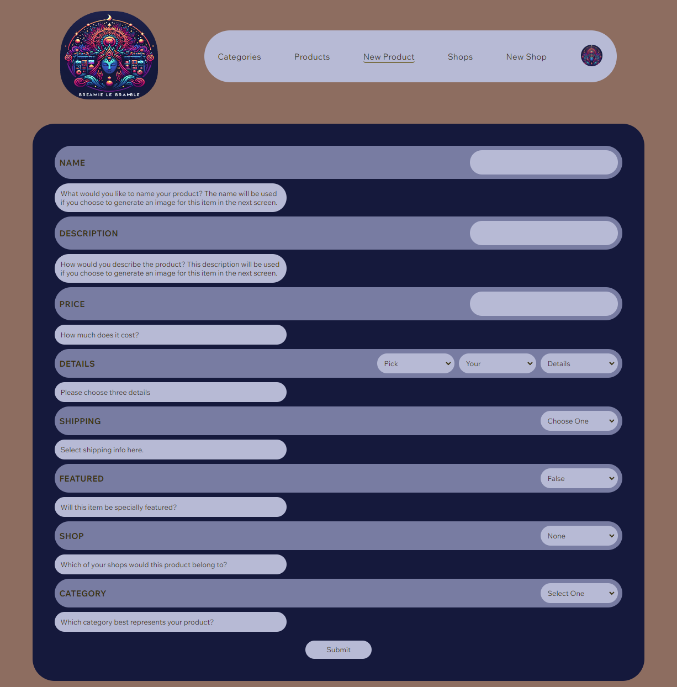

# Bramble

[Bramble Link](https://bramble-idq1.onrender.com/)

## Project Summary

Bramble is an Etsy clone with a mythical twist, users are encouraged to create their own categories, shops, and products with fantastic qualities. This site also features custom AI powered art generation influenced by user input.

## Screenshots

### Landing


### Categories


### Products


### Shops

[Shops Page](image-3.png)

### Create Product



### Create Shop


### Product Details


### Shop Details


## Build Instructions

 - Clone Github Repository
 - npm install in both the frontend and backend directories
 - You will have create a .env file in the backend directory where you will need the following variables:

 ```
 NODE_ENV=development
JWT_SECRET=<secret-here>
JWT_EXPIRES_IN=604800
SCHEMA=db/dev.db
DB_FILE=db/dev.db
AWS_ACCESS_KEY_ID=<key-here>
AWS_SECRET_ACCESS_KEY=<key here>
OPEN_API_KEY=<key here>
GOOGLE_OAUTH_CLIENT_ID=<key here>
GOOGLE_OAUTH_CLIENT_SECRET=<key here>
```

- After you will seed the database by running

```
npx dotenv sequelize db:migrate && npx dotenv sequelize db:seed:all
```

- You should then be ready to start your backend

```
npm start
```

- and frontend

```
npm run dev
```

- Open up your browser, typically with the vite package this application is using you should see your info at http://localhost:5173/

## Technologies used


